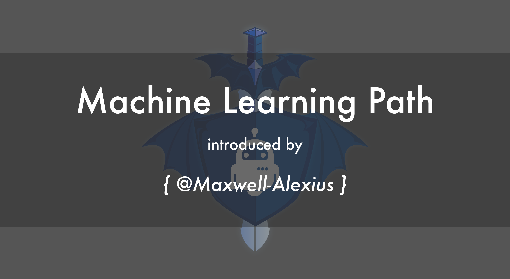

# 
Machine Learning Path

Welcome to Machine Learning Path - this series of article are from my <a target="_blank"  href="https://medium.com/@maximilianhuang">Medium Blog</a>. This series of article aims for introducing the field of Machine Learning in an easier and detailed way. I've learned Machine Learning from the course held by <a target="_blank" href="https://www.coursera.org/learn/machine-learning">Andrew Ng's Machine Learning on Coursera</a>. This series of article also are my notes taken from the coures! Enjoy!

## List of Contents

- <a target="_blank" href="https://medium.com/@maximilianhuang/machine-learning-path-i-f6894c07d4b2">(I) Introduction</a>
- <a target="_blank" href="https://medium.com/@maximilianhuang/machine-learning-path-ii-34ceee877bb0">(II) Linear Regression - Hypothesis Function</a>
- <a target="_blank" href="https://medium.com/@maximilianhuang/machine-learning-cost-function-e0abba6180ee">(III) Linear Regression - Cost Function</a>
- <a target="_blank" href="https://medium.com/@maximilianhuang/machine-learning-path-iv-565e55e9edf6">(IV) Linear Regressino - Gradient Descent</a>
- <a target="_blank" href="https://medium.com/@maximilianhuang/machine-learning-path-v-cbdb47aa4680">(V) Gradient Descent - Simple Implementation</a>
- (VI) Vectorization (i) (Working on...)